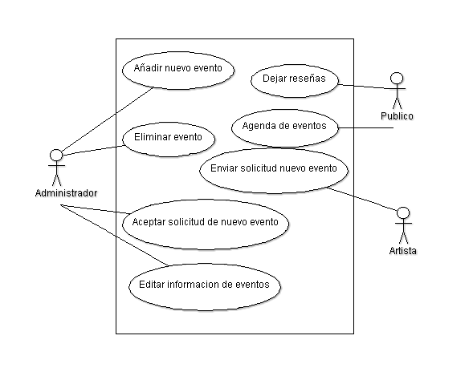
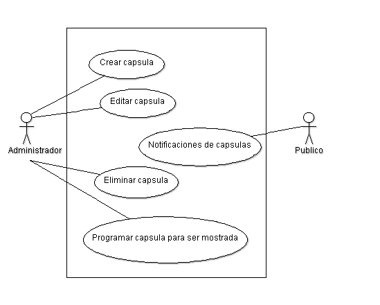

Diseño de la aplicacíon
=======================

Casos de Uso
------------

Administrador
*************
.. figure:: Diagramas/Administrador.png

Artistas
********
.. figure:: Diagramas/Artista.png

Actividades
***********

Capsulas
********

Estadisticas
************
.. figure:: Diagramas/Estadisticas.png

Clases
------

Diagramas de clases y de sus distintas actividades, si fuese necesario.

Diagrama de BD
--------------

Diagrama de la Base de Datos que requerirá el software.
